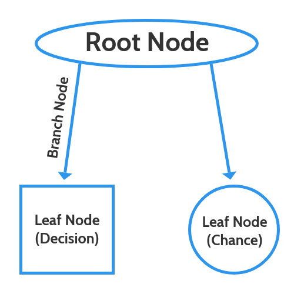

# Utilizing decision trees in R

## What is a decision tree?

A decision tree is a diagram or chart that people use to determine a course of action or show a statistical probability. It forms the outline of the namesake woody plant, usually upright but sometimes lying on its side. Each branch of the decision tree represents a possible decision, outcome, or reaction. The farthest branches on the tree represent the end results.^[https://www.investopedia.com/terms/d/decision-tree.asp]

A decision tree is a specific type of flow chart used to visualize the decision making process by mapping out different courses of action, as well as their potential outcomes.

### Advantages:

1. Compared to other algorithms decision trees requires less effort for data preparation during pre-processing.
2. A decision tree does not require normalization of data.
3. A decision tree does not require scaling of data as well.
4. Missing values in the data also do NOT affect the process of building a decision tree to any considerable extent.
5. A Decision tree model is very intuitive and easy to explain to technical teams as well as stakeholders.

### Disadvantage:

1. A small change in the data can cause a large change in the structure of the decision tree causing instability.
2. For a Decision tree sometimes calculation can go far more complex compared to other algorithms.
3. Decision tree often involves higher time to train the model.
4. Decision tree training is relatively expensive as the complexity and time has taken are more.
5. The Decision Tree algorithm is inadequate for applying regression and predicting continuous values.^[https://dhirajkumarblog.medium.com/top-5-advantages-and-disadvantages-of-decision-tree-algorithm-428ebd199d9a]

\newpage

## Decision trees typically consist of three different elements:

### Root Node:

This top-level node represents the ultimate objective, or big decision you’re trying to make.

### Branches:

Branches, which stem from the root, represent different options—or courses of action—that are available when making a particular decision. They are most commonly indicated with an arrow line and often include associated costs, as well as the likelihood to occur.

### Leaf Node:

The leaf nodes—which are attached at the end of the branches—represent possible outcomes for each action. There are typically two types of leaf nodes: square leaf nodes, which indicate another decision to be made, and circle leaf nodes, which indicate a chance event or unknown outcome. ^[https://venngage.com/blog/what-is-a-decision-tree/]

```{r echo=FALSE, out.width = "200px"}

```

^[https://venngage-wordpress.s3.amazonaws.com/uploads/2019/08/what-is-a-decision-tree-6.png]

\newpage

```{r}
library(xlsx)
breast.app <- read.xlsx(file="breast.xls",sheetIndex=1,header=T)
breast.test <- read.xlsx(file="breast.xls",sheetIndex=2,header=T)
```

The read.xlsx function provides a high level API for reading data from an Excel worksheet. It calls several low level functions in the process. Its goal is to provide the conveniency of read.table by borrowing from its signature.^[Read the contents of a worksheet into an R data.frame. From R official documentation.]

```{r}
library(rpart)
arbre.1 <- rpart(classe ~ ., data=breast.app, method="class")
print(arbre.1)
plot(arbre.1)
text(arbre.1)
```

This differs from the tree function in S mainly in its handling of surrogate variables. In most details it follows Breiman et. al (1984) quite closely. R package tree provides a re-implementation of tree.^[Recursive Partitioning and Regression Trees From R official documentation.]

\newpage

```{r}
library(rpart.plot)
rpart.plot(arbre.1)
```

This function is a simplified front-end to prp, with only the most useful arguments of that function, and with different defaults for some of the arguments. The different defaults mean that this function automatically creates a colored plot suitable for the type of model (whereas prp by default creates a minimal plot). See the prp help page for a table showing the different defaults.^[Plot an rpart model. A simplified interface to the prp function. From R official documentation.]

```{r}
pred.classe <- predict(arbre.1, newdata = breast.test, type = "class")
print(summary(pred.classe))
```

predict is a generic function for predictions from the results of various model fitting functions. The function invokes particular methods which depend on the class of the first argument.

Most prediction methods which are similar to those for linear models have an argument newdata specifying the first place to look for explanatory variables to be used for prediction. Some considerable attempts are made to match up the columns in newdata to those used for fitting, for example that they are of comparable types and that any factors have the same level set in the same order (or can be transformed to be so).

Time series prediction methods in package stats have an argument n.ahead specifying how many time steps ahead to predict.

Many methods have a logical argument se.fit saying if standard errors are to returned.^[Model Predictions From R official documentation.]


```{r}
mc <- table(breast.test$classe,pred.classe)
print(mc)
```

table uses the cross-classifying factors to build a contingency table of the counts at each combination of factor levels.^[Cross Tabulation and Table Creation From R official documentation.]

```{r}
erreur <- (mc[2,1]+mc[1,2])/sum(mc)
print(erreur)
```


error = Sum of elements outside the main diagonal / Total number of observations.

```{r}
parametres <- rpart.control(minsplit = 50, minbucket = 20)
arbre.2 <- rpart(classe ~ ., data=breast.app, method = "class", control = "parametres")
print(arbre.2)
```


Various parameters that control aspects of the rpart fit.

#### minsplit	

the minimum number of observations that must exist in a node in order for a split to be attempted.

#### minbucket	

the minimum number of observations in any terminal <leaf> node. If only one of minbucket or minsplit is specified, the code either sets minsplit to minbucket*3 or minbucket to minsplit/3, as appropriate.^[Control for Rpart Fits From R official documentation.]

\newpage

```{r}
library(tree)
param.3 <- tree.control(nobs=nrow(breast.app), mincut=20, minsize=50)
breast.app$classe <- as.factor(breast.app$classe)
arbre.3 <- tree(classe ~ ., data=breast.app, control=param.3)
print(arbre.3)
```

tree Draw a tree using box drawing characters. Unicode characters are used if available. (Set the cli.unicode option if auto-detection fails.)^[Draw a tree From R official documentation.]


tree.control A utility function for use with the control argument of tree.

#### nobs

The number of observations in the training set.

#### mincut

The minimum number of observations to include in either child node. This is a weighted quantity; the observational weights are used to compute the ‘number’. The default is 5.

#### minsize

The smallest allowed node size: a weighted quantity. The default is 10.

#### my note on this code

I had to convert the dataset to `as.factor` in order to be able to use it in the `tree()` function, before this step i was getting this error in R

`Warning message:
In tree(classe ~ ., data = breast.app, control = param.3) :
  NAs introduced by coercion`
  
so i had to add this code to fix it

```{r eval=FALSE}
breast.app$classe <- as.factor(breast.app$classe)
```
^[https://stackoverflow.com/questions/24807862/growing-a-tree-in-r]


